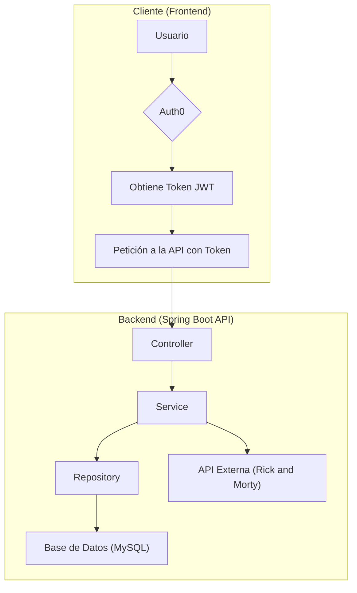

# Final Sistemas Distribuidos Lucas Bloise

API Rest para la gestión de personajes de Rick and Morty, permitiendo a los usuarios autenticados guardar sus personajes favoritos.

## Integrantes del grupo

-   **Lucas Bloise** - 113763

## Arquitectura del Proyecto

El proyecto sigue una arquitectura por capas, común en aplicaciones Spring Boot, que separa las responsabilidades en diferentes componentes lógicos:

-   **Controllers**: Exponen los endpoints de la API REST. Se encargan de recibir las peticiones HTTP, validarlas y delegar la lógica de negocio a la capa de servicios. Utilizan Spring Security para la autenticación y autorización basada en tokens JWT de Auth0.
-   **Services**: Contiene la lógica de negocio de la aplicación. Se comunica con la capa de repositorios para acceder a la base de datos y con servicios externos, como la API de Rick and Morty.
-   **Repositories**: Se encarga de la persistencia de los datos. Utiliza Spring Data JPA para interactuar con la base de datos MySQL.
-   **Entities**: Representan los objetos del dominio de la aplicación y se mapean a las tablas de la base de datos.
-   **DTOs (Data Transfer Objects)**: Se utilizan para transferir datos entre las capas de la aplicación, especialmente entre los controladores y los clientes de la API.
-   **Config**: Contiene la configuración de la aplicación, incluyendo la seguridad (Spring Security y Auth0) y la configuración de beans.

### Flujo de Autenticación

1.  El usuario se autentica en el frontend (fuera del alcance de este proyecto) a través de Auth0.
2.  El frontend obtiene un token JWT de Auth0.
3.  El frontend envía el token JWT en el header `Authorization` de cada petición a los endpoints protegidos de la API.
4.  Spring Security intercepta la petición, valida el token JWT (incluyendo la firma, el issuer y la audience) y extrae la información del usuario.
5.  Si el token es válido, se permite el acceso al endpoint solicitado.

### Diagrama de Arquitectura



## Tecnologías Utilizadas

-   **Java 17**: Lenguaje de programación principal.
-   **Spring Boot 3**: Framework para la creación de aplicaciones Java.
-   **Spring Web**: Para la creación de la API REST.
-   **Spring Data JPA**: Para la persistencia de datos.
-   **Spring Security**: Para la autenticación y autorización.
-   **Spring Security OAuth2 Resource Server**: Para la validación de tokens JWT.
-   **MySQL**: Base de datos relacional para almacenar la información de usuarios y favoritos.
-   **Auth0**: Para la gestión de la autenticación y la emisión de tokens JWT.
-   **Lombok**: Para reducir el código boilerplate en las entidades y DTOs.
-   **Gradle**: Como sistema de gestión de dependencias y construcción del proyecto.
-   **Docker**: Para la contenerización de la base de datos MySQL.
-   **RestTemplate**: Para el consumo de la API de Rick and Morty.

## Requisitos para su ejecución

-   **Java 17** o superior.
-   **Docker** y **Docker Compose**.
-   Una cuenta de **Auth0** con una API configurada.

## Instrucciones de instalación y ejecución

1.  **Clonar el repositorio:**

    ```bash
    git clone https://github.com/lucasbloise/final-sd-bloise.git
    cd final-sd-bloise
    ```

2.  **Configurar las variables de entorno de Auth0:**

    Crea un archivo `application.properties` en `src/main/resources` y añade las siguientes propiedades con tus credenciales de Auth0:

    ```properties
    auth0.audience=https://your-api-audience
    spring.security.oauth2.resourceserver.jwt.issuer-uri=https://your-auth0-domain/
    web.cors.allowed-origins=http://localhost:3000 # O el origen de tu frontend
    ```

3.  **Levantar la base de datos con Docker:**

    En la raíz del proyecto, ejecuta el siguiente comando:

    ```bash
    docker-compose up -d
    ```

4.  **Ejecutar la aplicación:**

    Puedes ejecutar la aplicación desde tu IDE o utilizando el wrapper de Gradle:

    ```bash
    ./gradlew bootRun
    ```

La API estará disponible en `http://localhost:8080`.

## Endpoints de la API

### Characters

-   `GET /api/characters`: Obtiene una lista paginada de personajes de la API de Rick and Morty.
    -   **Query Param**: `page` (opcional, por defecto 1).
    -   **Respuesta**: `RickAndMortyResponseDTO`

### Users

Estos endpoints requieren autenticación.

-   `POST /api/v1/users/createUser`: Crea un nuevo usuario en la base de datos a partir del token de autenticación.
-   `POST /api/v1/users/favorites`: Añade un personaje a la lista de favoritos del usuario.
    -   **Body**: `FavoriteRequestDTO` (`{ "characterId": 123 }`)
-   `GET /api/v1/users/favorites`: Obtiene la lista de personajes favoritos del usuario. 
